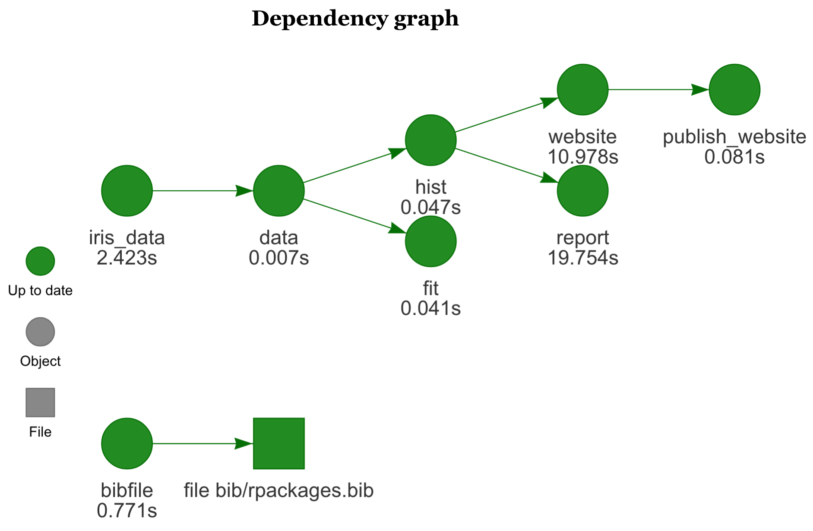

# Helpful Tools for Everyday Tasks
In this section, we will introduce some tools that make life as a researcher easier, when relying on computational analysis using R and RStudio.

## Automizing Builds Using Drake

One large challenge for literate programming is that for every small change in a document you need to re-run your complete analysis. This is not a problem with modern computers in many cases, but when your data is large enough, it can become a hassle. While RMarkdown does provide a caching mechanism, it is limited to the individual computer and may not be shared among researchers. And when individual code chunks depend on external data that has changed, RMarkdown caching no longer registers these changes. 

The package `r cite_pkg("drake")` addresses this challenge. By creating a plan using the `drake_plan` function we first determine what steps are necessary for our analysis. Drake then analyzes our code and files for implicit dependencies. It derives a dependency tree (see Fig. \@ref(fig:drake)) that visually shows how the project should run.

```{r drake, out.width="1\\linewidth", include=TRUE, fig.align="center", fig.cap=c("The drake plan to generate this document."), echo=FALSE}

```
Each build target (e.g., `report`) is the call to an R function. The result of which can easily be reloaded anywhere inside the project using the `loadd` or `readd` function. In the simplistic build path for this document, the `hist` target creates a histogram of the `iris_data`, which is downloaded from the OSF. The figure (see Fig. \@ref(fig:drakeout)) is then included in the document. Whenever a single previous dependency becomes outdated, the rest of the dependency graph is executed.


```{r drakeout, out.width="0.8\\linewidth", include=TRUE, fig.align="center", fig.cap=c("This figure was created  outside of the document in the hist target."), echo = FALSE}
library(drake)
readd("hist")
```

When all dependencies are properly modeled, drake allows running individual targets on multiple CPUs or a compute cluster without much overhead. The interested reader can take a look at the `make.R` file in the project root of this document. 

## Ensuring Relative Paths Using `here`
The `r cite_pkg("here")` package provides a useful tool to find files on all operating systems. Windows and Unix are famous for using different slashes as directory separators, which can make addressing file paths complicated for reproducible research. By encapsulating all file operations in the `here` function, the relative root is set to the destination of the R project file and directory separators are automatically inserted in accordance with the local operating system.

## Automating Project Setup Using `usethis`
When setting up a project, many tasks have to conducted over and over again. To simplify this the `r cite_pkg("usethis")` package provides a set of tools to start working on a project.
A typical workflow for setting up a project using `usethis` could look like this.

1. Create a project using `create_tidy_project`
2. Setup the license using, e.g., `use_mit_license`
3. Setup using git `use_git`
4. Setup using GitHub `use_github`
5. Setup a readme using `use_readme_rmd`
6. Setup a citation for your project `use_citation`

Running `git_vaccinate` once will add all files that typically contain credentials or other personal information to the global git-ignore file, preventing them from being accidentally shared. 

Another library that helps with setting up a project is the `r cite_pkg("rrtools")` package.

```{r eval=FALSE, include=FALSE}
# this is my autocomplete helper it is not executed
usethis::use_mit_license()
usethis::use_readme_rmd()
usethis::git_vaccinate()
#usethis::use_spell_check()
#usethis::use_testthat()
```


## Onboarding New Users to RStudio with Addins
Learning how to write code can be hard for someone changing over from UI-based approaches such as SPSS. However, there are several tools that help you create reproducible R code from the UI of RStudio. 
Such tools can be found in the "Addins" menu and we will highlight some that make research easier.

Working with factors is not always easy in R. They will appear in alphabetic order in plots, they are hard to rename and hard to reorganize. The `r cite_pkg("forcats")` package simplifies the use of factors, by unifying the interface to them. An addin from the `r cite_pkg("questionr")` package allows for easy recoding and relabeling of factors.

Creating custom plots using the `ggplot2` package creates usable figures for scientific papers. Yet, it may take a while to get accustomed to ggplot. The `r cite_pkg("esquisse")` package has an interactive addin (see Fig. \@ref(fig:esq)) that lets you drag and drop variables to axes, adjust layout and color, filter the data, and export the script that would generate the matching plot.


```{r esq, out.width="1\\linewidth", include=TRUE, fig.align="center", fig.cap=c("This is the interface to the ggplot builder from esquisse."), echo = FALSE}

library(ggstatsplot)
```

## Using `ggstatsplot` to generate meaningful statistical analyses

Knowing how to report a statistical finding often requires a deep understanding of what test to use and how to report the results adequately. The `r cite_pkg("ggstatsplot")` package provides a set of plotting functions that use very sensible defaults derived from the data input. If, for example, you want to compare means between multiple groups the `ggbetweenstats` function will produce a nice plot with all relevant statistical information---including effects sizes, confidence intervals, and Bayes factors.

The upcoming plot (Figure \@ref(fig:gg)) was created from a single line of code.


```{r gg, out.width="1\\linewidth", include=TRUE, fig.align="center", fig.cap=c("A comparison of means using the iris data."), echo=TRUE, message=FALSE}

ggbetweenstats(iris, Species, Sepal.Width, messages = F)

```


